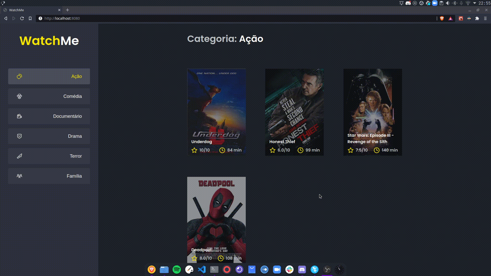

# WatchMe

Uma aplicação para listagem de filmes de acordo com gênero, desenvolvida durante o primeiro desafio do Ignite, bootcamp da Rocketseat, especificamente, da Trilha de ReactJS. O projeto foi desenvolvido a partir de um template previamente disponibilizado.

O principal objetivo do desafio foi refatorar o componente `App`, retirando toda a lógica e HTML dentro dele, dividindo-os em **três componentes**:

- `Sidebar`: Na sidebar é possível selecionar qual categoria de filmes deve ser listada;
- `Header`: O header da aplicação possui apenas o nome da categoria selecionada que deve mudar dinamicamente.
- `Content`: O content contém a listagem de cards dos filmes que estão contidos na categoria selecionada.

## Funcionamento da Aplicação

No gif abaixo é possível conferir o funcionamento da aplicação após a adição dos recursos solicitados:

